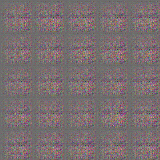

## DCGANs in [TensorFlow](https://github.com/tensorflow/tensorflow)
This repository is intended to be an example implementation of Deep Convolutional Generative Adversarial Networks (DCGANs) using TensorFlow. The model architecture used is based on the work of [Alec Radford, Luke Metz, and Soumith Chintala](https://arxiv.org/abs/1511.06434), and implements the tricks recommended in [github.com/southmith/ganhacks](https://github.com/soumith/ganhacks)

## Training on the Celeb-A dataset
The model can generate never before seen faces by training on a dataset of images of faces. Training the model for 5 epochs on the [CelebA dataset](http://mmlab.ie.cuhk.edu.hk/projects/CelebA.html) yeilds the following results:
- 5 epochs of training
<p align = 'center'>

</p>

## Documentation
### Download Your Dataset
Download your dataset of choice and extract it to `data/` or another directory of your choosing. You can use `bash setup-celeba.sh` to download and extract the Celeb-A dataset automatically.

### Training The Network
Use `train.py` to train the model on your dataset. If the images in your dataset are not all the same size or not a desired shape/size, you can use the `--crop-width`, `--crop-height`, `--rescale-width`, and `--rescale-height` commands to reshape the images as they are fed to the network. **Note:** the model can only be trained with images that have side dimensions which are divisible by 16. You can specify a directory with `--sample-dir` to generate a sample grid of images as the training takes place. [More details here](docs.md).
- Example usage:
```
python3 train.py --checkpoint-dir ./ckpt/ \
  --data-dir ./data/img_align_celeba/ \
  --crop-width 110 \
  --crop-height 110 \
  --rescale-width 64 \
  --rescale-height 64 \
  --sample-dir ./samples/ \
  --constant_z
```

### Generating Images
Use `generate.py` to generate images after the model has been trained. You must use `--checkpoint` to point the generator at a checkpoint directory saved during training. **The checkpoint directory must include the .meta file as well as the checkpoint file**. Use `output-dir` to specify where to place the generated images. Use `--num-images` to specify the quantity of images to generate and `--name` to name them (dont include a file extension). You can also use `--grid-size` generate multiple samples per image and arrange them in a square grid. [More details here](docs.md).
- Example usage:
```
python3 generate.py --checkpoint ./ckpt/ \
  --output-dir ./output/ \
  --num-images 12  \
  --name faces \
  --grid-size 5
```
### Requirements
The following must be installed:
- Python 3.6+
- Pillow 4.0.0
- Numpy 1.15.4
- TensorFlow 1.0.0
- The packages necessary to run TensorFlow on your GPU
  - Information on how to run TensorFlow on GPU can be found [here](https://www.tensorflow.org/install/)
  
Alternatively, if you have Anaconda installed, you can use the included `requirements.yml` file to create an Anaconda environment with the following command:
```
conda env create -f requirements.yml
```
Then activate the environment with:
```
source activate dcgan
```

