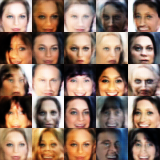

## DCGANs in [TensorFlow](https://github.com/tensorflow/tensorflow)
This repository is intended to be a simple example implementation of Deep Convolutional Generative Adversarial Networks (DCGANs) using TensorFlow. The model architecture used is based on the work of [Alec Radford, Luke Metz, Soumith Chintala](https://arxiv.org/abs/1511.06434), and implements the tricks recommended in [github.com/southmith/ganhacks](https://github.com/soumith/ganhacks)

# Training on the Celeb-A dataset
The model can generate never before seen faces by training on a dataset of images of faces. Training the model for 5 epochs on the [CelebA dataset](http://mmlab.ie.cuhk.edu.hk/projects/CelebA.html) yeilds the following results:
- after 1 epoch

